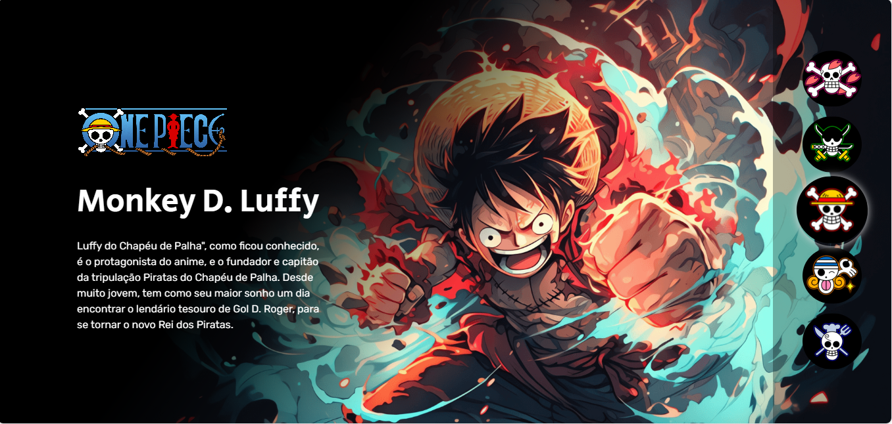

<h1 align="center"> One Piece - Evento Dev em Dobro </h1>

Programa exclusivo e gratuito, promovido pela DevemDobro para ensino de tecnologias WEB Frontend.  
<a href="https://devemdobro.com/matriculas-abertas/">Estude faça já a Dev Quest</a>

  <a href="#-tecnologias">Tecnologias</a>&nbsp;&nbsp;&nbsp;|&nbsp;&nbsp;&nbsp;
  <a href="#-projeto">Projeto</a>&nbsp;&nbsp;&nbsp;|&nbsp;&nbsp;&nbsp;
  <a href="#-layout">Layout</a>&nbsp;&nbsp;&nbsp;|&nbsp;&nbsp;&nbsp;
  <a href="#memo-licença">Licença</a>

  

 

  

 

## 🚀 Tecnologias

Esse projeto foi desenvolvido com as seguintes tecnologias:

- HTML e CSS
- JavaScript
- Git e Github
- Figma

## 💻 Projeto

O One Piece é um projeto frontend que muda o personagem ao clicar no botao de seu icone.

- [Acesse o projeto finalizado, online](https://#)

- [Assistir aulas](https://#)

## 🔖 Layout

Você pode visualizar o layout do projeto através [DESSE LINK](https://#). É necessário ter conta no [Figma](https://figma.com) para acessá-lo.

## :memo: Licença

Esse projeto está sob a licença MIT.

---

Feito por Jhonatan Pacheco com ♥ by Devemdobro [Participe da nossa comunidade!](https://#)
